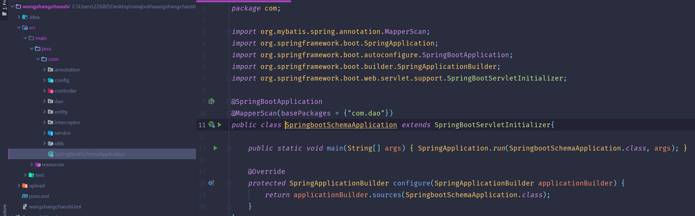
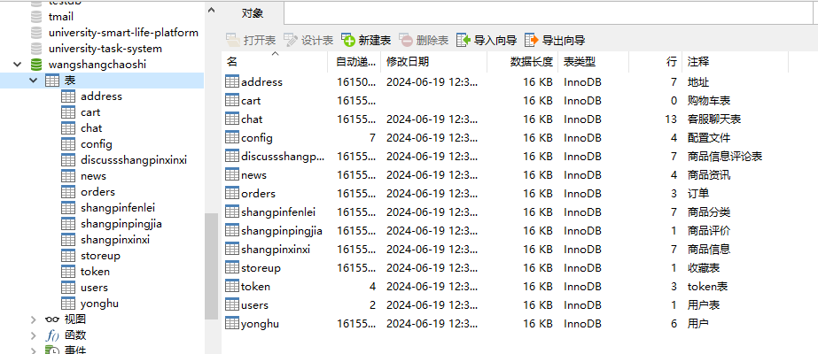
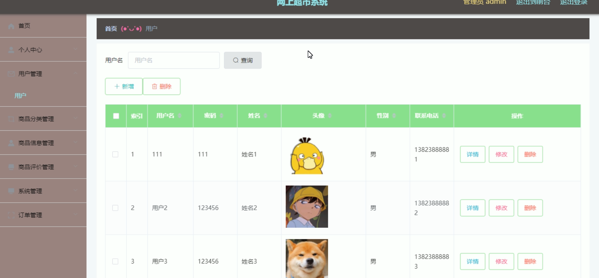
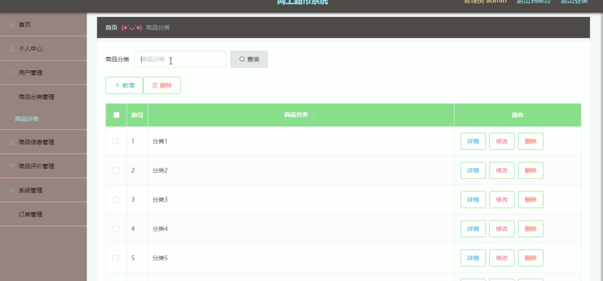
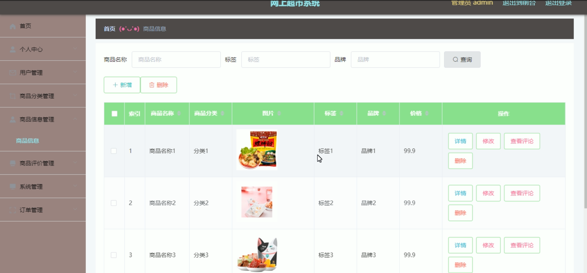
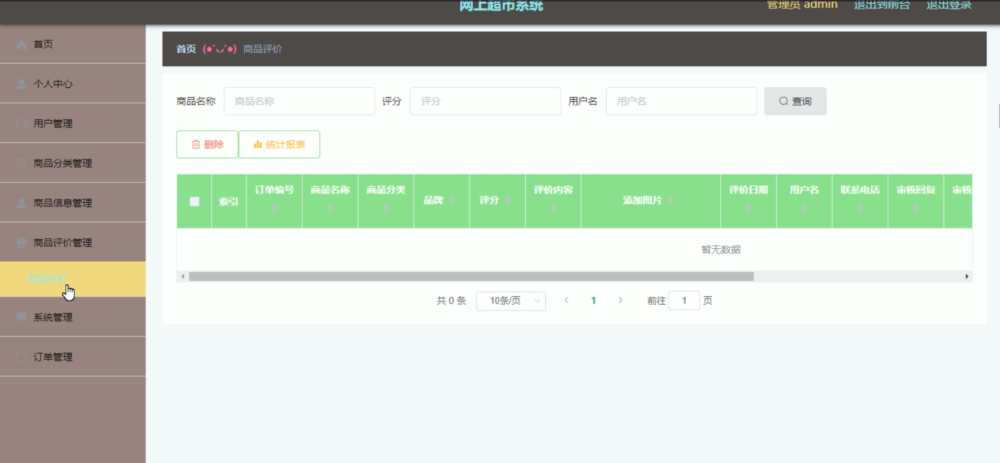
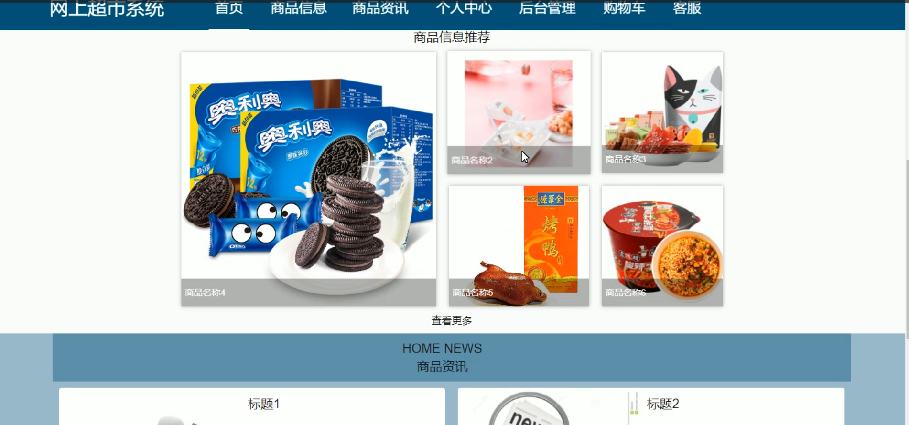
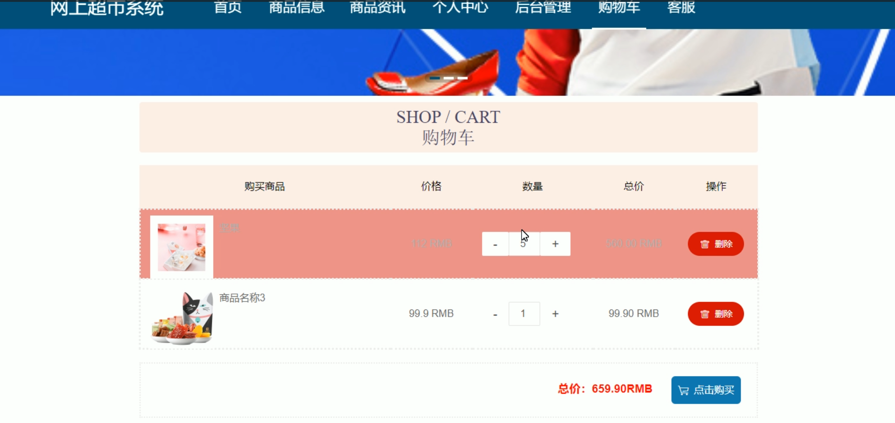
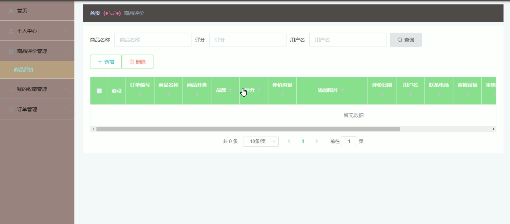
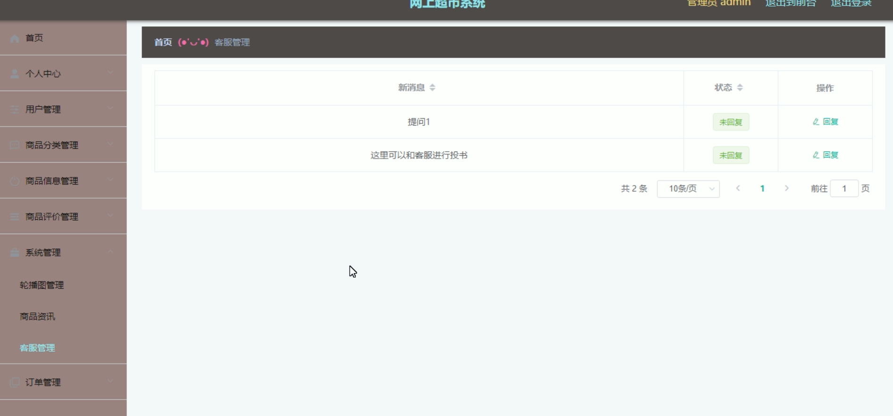

# 基于SpringBoot网上超市的设计与实现

---
### 👉作者QQ ：1556708905 微信：zheng0123Long (支持定制修改、部署调试、定制毕设)

### 👉接网站建设、小程序、H5、APP、各种系统等

---

#### 介绍

基于SpringBoot的网上超市系统是一款功能全面的在线购物平台，旨在为用户提供便捷、高效的购物体验，同时为管理员提供高效的管理工具。系统分为两个主要角色：管理员角色和用户角色。每个角色拥有特定的功能模块，满足各自的需求和职责。

#### 技术栈介绍

后端技术栈：Springboot+Mysql+Maven

前端技术栈：Vue+Html+Css+Javascript+ElementUI

开发工具：Idea+Vscode+Navicate

#### 系统功能介绍

管理员角色功能模块

个人中心：管理员可以在个人中心查看和编辑个人信息，包括修改密码和更新联系方式等。

用户管理：管理员可以管理平台用户的信息，包括用户的注册、修改、删除等操作，以及查看用户的活动记录。

商品分类管理：管理员可以管理商品的分类，方便商品的组织和查找，包括新增、修改和删除分类信息。

商品信息管理：管理员可以管理商品的详细信息，如添加新商品、修改商品信息、删除商品等，确保商品信息的准确性和及时更新。

商品评价管理：管理员可以查看和管理用户对商品的评价，审核评价内容，确保评价的真实性和有用性。

系统管理：管理员负责整个系统的管理，包括系统配置、维护、安全设置等，保证系统的正常运行。

订单管理：管理员可以查看和管理所有订单信息，包括订单的生成、处理、发货、售后服务等，确保订单的及时处理和用户满意度。

用户角色功能模块

商品信息：用户可以浏览和查看平台上所有商品的详细信息，包括价格、描述、评价等，帮助用户做出购买决策。

商品资讯：用户可以查看最新的商品资讯和促销信息，了解平台上的最新动态和优惠活动。

个人中心：用户可以在个人中心查看和管理自己的个人信息，包括修改密码、更新联系方式等。

后台管理：

商品评价管理：用户可以查看自己对购买商品的评价记录，管理和修改自己的评价内容。

我的收藏管理：用户可以管理自己收藏的商品，方便快速找到感兴趣的商品。

订单管理：用户可以查看和管理自己的订单信息，包括订单的状态、物流信息、售后服务等。

购物车：用户可以将感兴趣的商品加入购物车，方便集中结算和管理，支持批量购买。

客服：用户可以通过客服模块与平台客服人员进行沟通，咨询商品信息、解决购物问题和处理售后服务。

#### 系统作用

对管理员的作用

高效管理：系统提供了一整套管理工具，帮助管理员高效地管理用户、商品和订单信息。

提升服务质量：通过商品评价管理和订单管理，管理员可以及时了解用户反馈，提升商品质量和服务水平。

系统维护：系统管理功能确保平台的安全和稳定运行，提升用户的购物体验。

对用户的作用

便捷购物：用户可以通过系统方便地浏览和购买商品，享受便捷的在线购物体验。

信息获取：用户可以及时获取最新的商品资讯和优惠信息，做出更明智的购物决策。

个性化管理：个人中心和后台管理功能帮助用户管理自己的购物信息和个人资料，提升用户满意度。

#### 系统功能截图

代码结构

数据库表

登录

用户管理

商品分类管理

商品信息管理

商品评价

前台首页

购物车

用户端后台管理

客服管理

#### 总结

基于SpringBoot的网上超市系统通过清晰的角色分配和丰富的功能模块，满足了管理员和用户的不同需求。管理员可以高效地管理平台运营，确保商品和服务质量；用户则享受到便捷的在线购物和优质的客户服务。系统的设计和实现不仅提高了管理效率，也显著提升了用户的购物体验，为现代电子商务的发展提供了有力的支持。

#### 使用说明

创建数据库，执行数据库脚本 修改jdbc数据库连接参数 下载安装maven依赖jar 启动idea中的springboot项目

网址：http://localhost:8080/wangshangchaoshi/admin/dist/index.html#/login 后台管理 http://localhost:8080/wangshangchaoshi/front/index.html 前台

管理员  admin  密码：admin   

